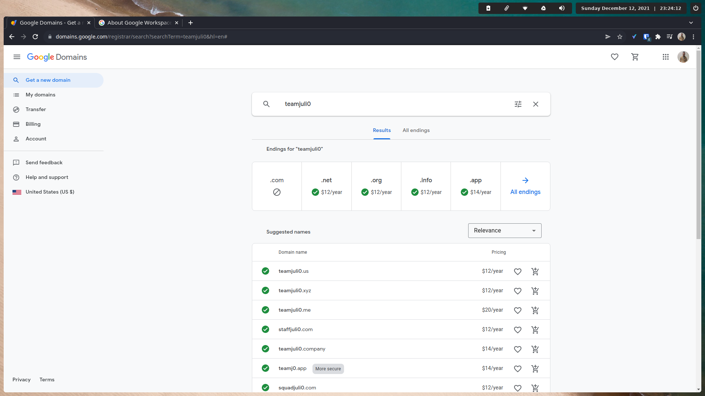

# Hosting your portfolio (or front-end application) with a custom domain

## 1) Sign up for and host your portfolio on [Netlify](https://netlify.com/).

<br>


<br>


## 2) Once your portfolio is hosted on Netlify, your portfolio will be given a random name/url. This name/url will be important in one of the steps found below.

<br>


<br>

    
## 2b) If you are hosting a front-end React portfolio, you will also have to navigate to Site settings => Build & deploy and fill in the the following information.
    
If your React portfolio lives inside of the client folder in your repo:
    
```
Base directory: client
Build command: CI= npm run build
Publish directory: client/build

For the publish directory, you only have to type in build as the client string will already be filled in for you

```

<br>


<br>


If your React portfolio lives in the root of your repo:

```
Base directory:
Build command: CI= npm run build
Publish directory: build
```

## 3) Once your portfolio had been successfully hosted on Netlify, navigate to [Google Domains](https://domains.google) and purchase a professional url. Preferably your url should be firstnamelastname.com or .dev if .com is unavailable.

<br>



<br>


## 4) Once the purchase is complete, navigate to the domain settings followed by DNS on the left hand sidebar. Make sure that the Default name servers are active and click Manage custom records.

<br>


<br>


## 5) Here we will be adding the two following custom records:

| Host name | Type | TTL | Data (Netlify default domain + dot at the end) |
| --- | --- | --- | --- |
| | A | 3600 | 75.2.60.5 |
| www | CNAME | 3600 | hopeful-hypatia-00bf4d.netlify.app. |

<br>


<br>


## 6) Go back to netlify and go to your portfolio's settings by navigating to Site settings => Domain Management followed by clicking on the "Add custom domain" button.

<br>


<br>


## 7) Add in your custom domain (including www) and verify that it's your domain. You will have to click on two verification buttons on this step.

<br>


<br>


## 8) From here, it will take anywhere from a couple of minutes to up to 24 hours for Netlify to verify the DNS. Once the verification is done, you will officially have connected your portfolio to your custom domain.

<br>


<br>
